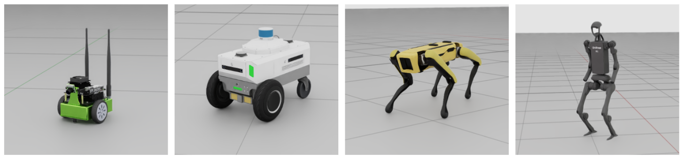
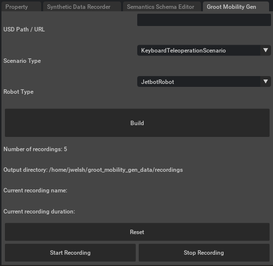
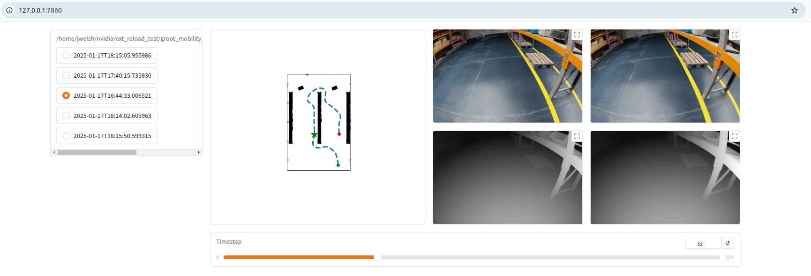

<h1 align="center"><span>MobilityGen</span></h1>

<div align="center">
A toolset built on <a href="https://developer.nvidia.com/isaac/sim">NVIDIA Isaac Sim</a> that 
allows you to easily collect data for mobile robots.
<br></br>
<div>


</div>

Read below to learn more.

</div>

## Overview

MobilityGen is a toolset built on [NVIDIA Isaac Sim](https://developer.nvidia.com/isaac/sim) that enables you to easily generate and collect data for mobile robots.  

It supports

- ***Rich ground truth data***

    - Occupancy Map
    - Pose
    - Joint Positions / Velocities
    - RGB Images
    - Segmentation Images
    - Depth Images
    - *If you're interested in more, [let us know!](https://github.com/NVlabs/MobilityGen/issues)*

- ***Many robot types*** 

    - Differential drive - Jetbot, Carter
    - Quadruped - Spot
    - Humanoid - H1
    - *Implement your own by subclassing the [Robot](./exts/omni.ext.mobility_gen/omni/ext/mobility_gen/robots.py) class*

- ***Many data collection methods***

    - Manual - Keyboard Teleoperation, Gamepad Teleoperation
    - Automated - Random Accelerations, Random Path Following
    - *Implement your own by subclassing the [Scenario](./exts/omni.ext.mobility_gen/omni/ext/mobility_gen/scenarios.py) class*

This enables you to train models and test algorithms related to robot mobility.

To get started with MobilityGen follow the setup and usage instructions below!

## Table of Contents

- [🛠️ Setup](#setup)
- [👍 Basic Usage](#usage)
- [💡 How To Guides](#guides)
    - [How to record procedural data](#how-to-procedural-data)
    - [How to implement a custom robot](#how-to-custom-robot)
    - [How to implement a custom scenario](#how-to-custom-scenario)
- [📝 Data Format](#-data-format)
- [👏 Contributing](#-contributing)
- 

<a id="setup"></a>
## 🛠️ Setup

Follow these steps to set up MobilityGen

### Step 1 - Install Isaac Sim

1. Download [Isaac Sim 4.5.0](https://docs.isaacsim.omniverse.nvidia.com/latest/installation/download.html)

    > We'll assume you use the zip file and extract it to ``~/isaacsim``.

### Step 2 - Clone this repository

1. Clone the repository

    ```bash
    git clone <repo_url> MobilityGen
    ```

> Remember the path you cloned to for the next step.

### Step 3 - Link Isaac Sim

Next, we'll call ``link_app.sh`` to link the Isaac Sim installation directory to the local ``app`` folder.

1. Navigate to the repo root

    ```bash
    cd MobilityGen
    ```

2. Run the following to link the ``app`` folder and pass it the path to where you installed Isaac Sim

    ```bash
    ./link_app.sh --path ~/isaacsim
    ```

<details>
> This step is helpful as it (1) Enables us to use VS code autocompletion (2) Allows us to call ./app/python.sh to launch Isaac Sim Python scripts (3) Allows us to call ./app/isaac-sim.sh to launch Isaac Sim.
</details>

### Step 4 - Install other python dependencies (including C++ path planner) (for procedural generation) 

1. Install miscellaneous python dependencies

    ```bash
    ./app/python.sh -m pip install tqdm
    ```

2. Navigate to the path planner directory

    ```bash
    cd MobilityGen/path_planner
    ```

3. Install with pip using the Isaac Sim python interpreter

    ```bash
    ../app/python.sh -m pip install -e .
    ```

### Step 4 - Launch Isaac Sim

1. Navigate to the repo root

    ```bash
    cd MobilityGen
    ```

2. Launch Isaac Sim with required extensions enabled by calling

    ```bash
    ./scripts/launch_sim.sh
    ```

That's it!  If everything worked, you should see Isaac Sim open with a window titled ``MobilityGen`` appear.  



Read [Usage](#usage) below to learn how to generate data with MobilityGen.

<a id="usage"></a>
## 👍 Basic Usage

Below details a typical workflow for collecting data with MobilityGen.

### Step 1 - Launch Isaac Sim

1. Navigate to the repo root

    ```bash
    cd MobilityGen
    ```

2. Launch Isaac Sim with required extensions enabled by calling

    ```bash
    ./scripts/launch_sim.sh
    ```

### Step 2 - Build a scenario

This assumes you see the MobilityGen extension window.

1. Under Scene USD URL / Path copy and paste the following

    ```
    http://omniverse-content-production.s3-us-west-2.amazonaws.com/Assets/Isaac/4.2/Isaac/Environments/Simple_Warehouse/warehouse_multiple_shelves.usd
    ```

2. Under the ``Scenario`` dropdown select ``KeyboardTeleoperationScenario`` to start

3. Under the ``Robot`` dropdown select ``H1Robot``

4. Click ``Build``

After a few seconds, you should see the scene and occupancy map appear.

### Step 3 - Initialize / reset the scenario

1. Click the ``Reset`` function to randomly initialize the scenario.  Do this until the robot spawns inside the warehouse.


### Step 4 - Test drive the robot

Before you start recording, try moving the robot around to get a feel for it

To move the robot, use the following keys

- ``W`` - Move Forward
- ``A`` - Turn Left
- ``S`` - Move Backwards
- ``D`` - Turn right

### Step 5 - Start recording!

Once you're comfortable, you can record a log.

1. Click ``Start Recording`` to start recording a log.

    > You should now see a recording name and the recording duration change.
2. Move the robot around
3. Click ``Stop Recording`` to stop recording.

The data is recorded to ``~/MobilityGenData/recordings`` by default.

### Step 6 - Render data

If you've gotten this far, you've recorded a trajectory, but it doesn't include the rendered sensor data.

Rendering the sensor data is done offline.  To do this call the following

1. Close Isaac Sim if it's running

2. Navigate to the repo root

    ```bash
    cd MobilityGen
    ```

3. Run the ``scripts/replay_directory.py`` script to replay and render all recordings in the directory

    ```bash
    python scripts/replay_directory.py --render_interval=200
    ```

    > Note: For speed for this tutorial, we use a render interval of 200.  If our physics timestep is 200 FPS, this means we 
    > render 1 image per second.

That's it! Now the data with renderings should be stored in ``~/MobilityGenData/replays``

### Step 7 - Visualize the Data

We provide a few examples in the [examples](./examples) folder for working with the data.

One example is using Gradio to explore all of the recordings in the replays directory.  To run this example,
call the following

1. Call the gradio data visualization example script

    ```bash
    python examples/04_visualize_gradio.py
    ```

2. Open your web browser to ``http://127.0.0.1:7860`` to explore the data

If everything worked, you should be able to view the data in the browser.



### Next steps

That's it!  Once you've gotten the hang of how to record data, you might try

1. Record data using one of the procedural methods (like ``RandomAccelerationScenario`` or ``RandomPathFollowingScenario``).

    > These methods don't rely on human input, and automatically "restart" when finished to create new recordings.

2. Implement or customize your own [Robot](./exts/omni.ext.mobility_gen/omni/ext/mobility_gen/robots.py) class.
3. Implement or customize your own [Scenario](./exts/omni.ext.mobility_gen/omni/ext/mobility_gen/scenarios.py) class.

If you find MobilityGen helpful for your use case, run in to issues, or have any questions please [let us know!](https://github.com/NVlabs/MobilityGen/issues).

<a id="contributing"></a>

<a id="usage"></a>
## 💡 How To Guides

<a id="how-to-procedural-data"></a>
### How to record procedural data

#### Step 1 - Launch Isaac Sim

This is the same as in the basic usage.

1. Navigate to the repo root

    ```bash
    cd MobilityGen
    ```

2. Launch Isaac Sim with required extensions enabled by calling

    ```bash
    ./scripts/launch_sim.sh
    ```

#### Step 2 - Build a scenario

1. Under Scene USD URL / Path copy and paste the following

    ```
    http://omniverse-content-production.s3-us-west-2.amazonaws.com/Assets/Isaac/4.2/Isaac/Environments/Simple_Warehouse/warehouse_multiple_shelves.usd
    ```

2. Under the ``Scenario`` dropdown select ``RandomPathFollowingScenario`` or ``RandomAccelerationScenario``

3. Under the ``Robot`` dropdown select ``H1Robot``

4. Click ``Build``

After a few seconds, you should see the scene and occupancy map appear.

#### Step 3 - Record data

1. Click ``Start Recording`` to start recording data

2. Go grab some coffee!  

    > The procedural generated methods automatically determine when to reset (ie: if the robot collides with
    > an object and needs to respawn).  If you run into any issues with the procedural methods getting stuck, please let us know.

3. Click ``Stop Recording`` to stop recording data.

The data is recorded to ``~/MobilityGenData/recordings`` by default.

#### Step 4 - Render and visualize sensor data

This is the same as before.  Please refer to Step 6-7 of the "Basic Usage" guide.

<a id="how-to-custom-robot"></a>
### How to implement a new robot

You can implement a new robot for use with MobilityGen.

The general workflow is as follows:

1. Subclass the [Robot](exts/omni.ext.mobility_gen/omni/ext/mobility_gen/robots.py) class.
2. Implement the ``build()`` method.  This method is responsible for adding the robot to the USD stage.
2. Implement the ``write_action()`` method.  This method performs the logic of applying the linear, angular velocity command.
3. Overwrite the common class parameters (like ``physics_dt``, ``occupancy_map_z_min``, etc.)
4. Register the robot class by using the ``ROBOT.register()`` decorator.  This makes the custom robot discoverable.

We recommend referencing the example robots in [robots.py](exts/omni.ext.mobility_gen/omni/ext/mobility_gen/robots.py) for more details.

A good way to start could be simply by modifying an existing robot.  For example, you might change the position at which
the camera is mounted on the H1 robot.

<a id="how-to-custom-scenario"></a>
### How to implement a new scenario

You can implement a new data recording scenario for use with MobilityGen.

The general workflow is as follows:

1. Subclass the [Scenario](exts/omni.ext.mobility_gen/omni/ext/mobility_gen/scenarios.py) class.
2. Implement the ``reset()`` method.  This method is responsible for randomizing / initializing the scenario (ie: spawning the robot).
3. Implement the ``step()`` method.  This method is responsible for incrementing the scenario by one physics step.
4. Register the scenario class by using the ``SCENARIOS.register()`` decorator.  This makes the custom scenario discoverable.

We recommend referencing the example scenarios in [scenarios.py](exts/omni.ext.mobility_gen/omni/ext/mobility_gen/scenarios.py) for more details.

A good way to start could be simply by modifying an existing scenario.  For example, you might implement a new method
for generating random motions.

## 📝 Data Format

MobilityGen records two types of data.  

- *Static Data* is recorded at the beginning of a recording
    - Occupancy map
    - Configuration info
        - Robot type
        - Scenario type
        - Scene USD URL
    - USD Stage
- *State Data* is recorded at each physics timestep
    - Robot action: Linear, angular velocity
    - Robot pose: Position, quaternion
    - Robot joint Positions / Velocities
    - Robot sensor data:
        - Depth image
        - RGB Image
        - Segmentation image / info

This data can easily be read using the [Reader](./examples/reader.py) class.

```python
from reader import Reader

reader = Reader(recording_path="replays/2025-01-17T16:44:33.006521")

print(len(reader)) # print number of timesteps

state_dict = reader.read_state_dict(0)  # read timestep 0
```

The state_dict has the following schema

```
{
    "robot.action": np.ndarray,                                      # [2] - Linear, angular command velocity
    "robot.position": np.ndarray,                                    # [3] - XYZ
    "robot.orientation": np.ndarray,                                 # [4] - Quaternion
    "robot.joint_positions": np.ndarray,                             # [J] - Joint positions
    "robot.joint_velocities": np.ndarray,                            # [J] - Joint velocities
    "robot.front_camera.left.rgb_image": np.ndarray,                 # [HxWx3], np.uint8 - RGB image
    "robot.front_camera.left.depth_image": np.ndarray,               # [HxW], np.fp32 - Depth in meters
    "robot.front_camera.left.segmentation_image": np.ndarray,        # [HxW], np.uint8 - Segmentation class index
    "robot.front_camera.left.segmentation_info": dict,               # see Isaac replicator segmentation info format
    "robot.front_camera.left.position": np.ndarray,                  # [3] - XYZ camera world position
    "robot.front_camera.left.orientation": np.ndarray,               # [4] - Quaternion camera world orientation
    ...
}
```

The ``Reader`` class abstracts away the details of reading the state dictionary
from the recording.

In case you're interested, each recording is represented as a directory with the following structure

```
2025-01-17T16:44:33.006521/
    occupancy_map/
        map.png
        map.yaml
    config.json
    stage.usd
    state/
        common/
            00000000.npy
            00000001.npy
            ...
        depth/
            robot.front_camera.left.depth_image/
                00000000.png
                00000001.png
                ...
            robot.front_camera.right.depth_image/
                ...
        rgb/
            robot.front_camera.left.rgb_image/
                00000000.jpg
                00000001.jpg
            robot.front_camera.right.rgb_image/
                ...
        segmentation/
            robot.front_camera.left.segmentation_image/
                00000000.png
                00000001.png
                ...
            robot.front_camera.right.segmentation_image/
                ...
```

Most of the state information is captured under the ``state/common`` folder, as dictionary in a single ``.npy`` file.

However, for some data (images) this is inefficient.  These instead get captured in their own folder based on the data
type and the name.  (ie: rgb/robot.front_camera.left.depth_image).  

The name of each file corresponds to its physics timestep.

If you have any questions regarding the data logged by MobilityGen, please [let us know!](https://github.com/NVlabs/MobilityGen/issues)


## 👏 Contributing
This [Developer Certificate of Origin](https://developercertificate.org/) applies to this project.

### Core Contributor
John Welsh, Huihua Zhao, Vikram Ramasamy, Wei Liu, Joydeep Biswas, Soha Pouya, Yan Chang
